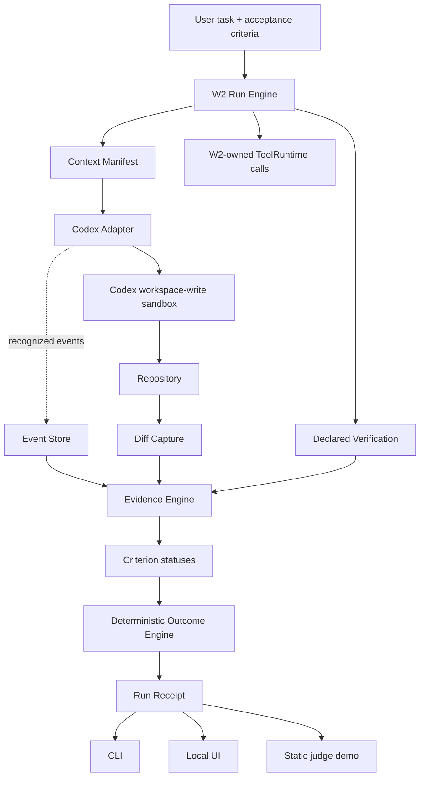

# W2 Run Flow

Codex native operations use the Codex sandbox and do not pass through W2 `ToolRuntime`. W2 stores recognized events, repository diffs, and verifier results. The context record distinguishes what W2 considered, selected, and provided; exact Codex file reads remain unknown unless telemetry establishes them.
