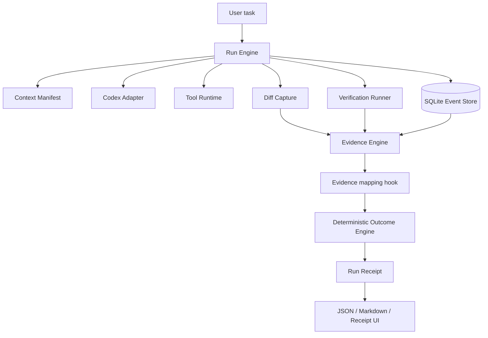

# W2 Architecture

Deterministic facts come from Git, SQLite, tool runtime, verification processes, timestamps, diffs, and exit codes. Interpretation is bounded by stored evidence IDs; it cannot create facts or override a deterministic outcome.
