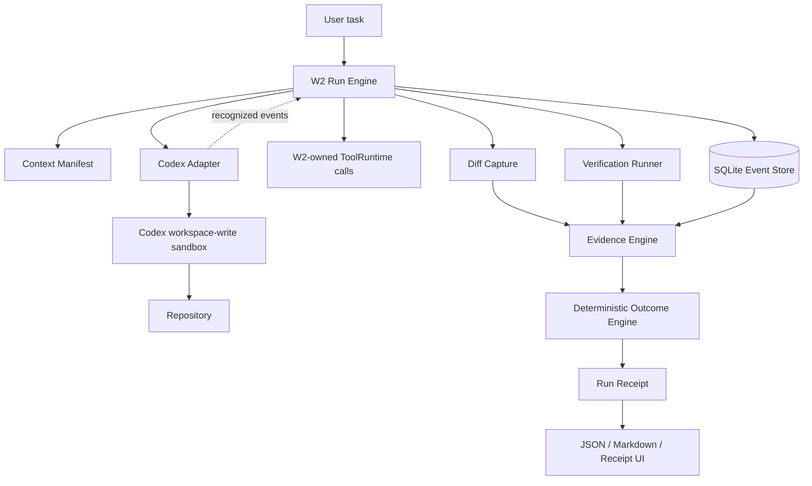

# W2 Architecture

Native Codex calls use Codex's sandbox and do not pass through W2 ToolRuntime. W2 observes recognized events, the resulting repository diff, and verifier results; it does not capture all file reads or broker every native action. No live GPT-5.6 evidence mapper is installed.
